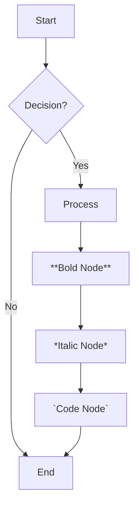
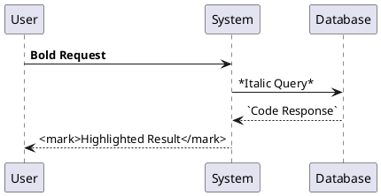
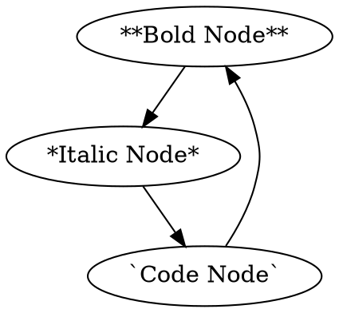

# Comprehensive Markdown Test

This document tests **every single markdown feature** including nested structures, advanced syntax, and edge cases.

## 1. Basic Text Formatting

### Inline Formatting
- **Bold text** and *italic text*
- ***Bold and italic combined***
- `inline code` and **bold `code` text**
- ~~Strikethrough text~~
- <mark>Highlighted text</mark>
- <kbd>Ctrl</kbd> + <kbd>C</kbd> for copy
- <sub>Subscript</sub> and <sup>Superscript</sup>
- <abbr title="HyperText Markup Language">HTML</abbr>
- <cite>The Art of Markdown</cite>
- <dfn>Markdown</dfn> is a lightweight markup language
- <time datetime="2025-01-27">January 27, 2025</time>
- <var>x</var> = <var>y</var> + <var>z</var>
- <samp>Error: File not found</samp>
- <small>Small text for fine print</small>
- <ins>Inserted text</ins>
- <del>Deleted text</del>
- <u>Underlined text</u>

### Nested Inline Formatting
- **Bold with *italic* inside**
- ***Bold italic with `code` inside***
- <mark>Highlight with **bold** and *italic*</mark>
- `Code with **bold** and *italic* inside`

## 2. Headings and Structure

# H1 Heading
## H2 Heading
### H3 Heading
#### H4 Heading
##### H5 Heading
###### H6 Heading

### Nested Headings with Complex Content
#### **Bold H4** with *italic* and `code`
##### <mark>Highlighted H5</mark> with [link](#)
###### `Code H6` with **bold** and *italic*

## 3. Lists and Nested Structures

### Unordered Lists
- First level item
  - Second level item
    - Third level item
      - Fourth level item
        - Fifth level item with **bold** and *italic*
          - Sixth level item with `code` and [link](#)
            - Seventh level item with <mark>highlight</mark>
              - Eighth level item with <kbd>keyboard</kbd>

### Ordered Lists
1. First ordered item
   1. Second level ordered
      1. Third level ordered
         1. Fourth level ordered
            1. Fifth level with **bold**
               1. Sixth level with *italic*
                  1. Seventh level with `code`
                     1. Eighth level with <mark>highlight</mark>

### Mixed Lists
1. Ordered item
   - Unordered sub-item
     - Another unordered sub-item
       1. Ordered sub-sub-item
          - Unordered sub-sub-sub-item
            - Final nested item

### Definition Lists
Term 1
: Definition 1 with **bold** and *italic*

Term 2
: Definition 2 with `code` and [link](#)

Term 3
: Definition 3 with <mark>highlight</mark>

## 4. Links and References

### Basic Links
- [Simple link](https://example.com)
- [Link with title](https://example.com "Example Title")
- [Link with **bold** text](https://example.com)
- [Link with *italic* text](https://example.com)
- [Link with `code` text](https://example.com)

### Reference Links
[Reference link][ref1] and [another reference][ref2].

[ref1]: https://example1.com "First Reference"
[ref2]: https://example2.com "Second Reference"

### Complex Link Structures
- [**Bold link text**](https://example.com)
- [*Italic link text*](https://example.com)
- [<mark>Highlighted link</mark>](https://example.com)
- [Link with `code` and **bold**](https://example.com)

## 5. Images and Media

### Basic Images


### Complex Image Structures


### Image Links
[](https://example.com)

## 6. Code Blocks

### Inline Code
Use `console.log("Hello World")` in your JavaScript code.

### Code Blocks with Language
```javascript
function greet(name) {
  // This is a comment with **bold** and *italic*
  const message = `Hello, ${name}!`;
  console.log(message);
  
  // Nested objects and arrays
  const data = {
    user: {
      name: name,
      age: 25,
      hobbies: ['coding', 'reading', 'gaming']
    },
    settings: {
      theme: 'dark',
      notifications: true
    }
  };
  
  return data;
}
```

### Complex Code with Nested Structures
```python
class MarkdownProcessor:
    def __init__(self, content: str):
        self.content = content
        self.processors = {
            'bold': self.process_bold,
            'italic': self.process_italic,
            'code': self.process_code,
            'links': self.process_links
        }
    
    def process_content(self) -> str:
        """Process markdown content with nested structures."""
        result = self.content
        
        # Process nested elements
        for processor_name, processor_func in self.processors.items():
            result = processor_func(result)
        
        return result
    
    def process_bold(self, text: str) -> str:
        # Handle **bold** text
        import re
        pattern = r'\*\*(.*?)\*\*'
        return re.sub(pattern, r'<strong>\1</strong>', text)
```

### Fenced Code with Complex Content
````markdown
```javascript
// This code block contains markdown syntax
const markdown = `
# Heading
**Bold text** and *italic text*

- List item 1
  - Nested item
    - Deeply nested item

\`\`\`python
print("Code block inside markdown")
\`\`\`
`;
```
````

## 7. Blockquotes and Nested Quotes

### Basic Blockquotes
> This is a basic blockquote.

### Nested Blockquotes
> First level quote
> > Second level quote
> > > Third level quote
> > > > Fourth level quote with **bold** and *italic*

### Complex Blockquotes
> **Bold quote text** with *italic* and `code`
> 
> > Nested quote with <mark>highlight</mark>
> > 
> > > Deeply nested with [link](#) and <kbd>keyboard</kbd>

## 8. Tables

### Basic Table
| Header 1 | Header 2 | Header 3 |
|----------|----------|----------|
| Cell 1   | Cell 2   | Cell 3   |
| Cell 4   | Cell 5   | Cell 6   |

### Complex Table with Formatting
| **Bold Header** | *Italic Header* | `Code Header` |
|-----------------|-----------------|---------------|
| **Bold cell**   | *Italic cell*   | `Code cell`   |
| <mark>Highlight</mark> | [Link](#) | <kbd>Key</kbd> |

### Table with Nested Content
| Column 1 | Column 2 | Column 3 |
|----------|----------|----------|
| **Bold** with *italic* | `Code` and [link](#) | <mark>Highlight</mark> |
| Nested **bold** and *italic* | Complex `code` with **bold** | Mixed <kbd>keyboard</kbd> |

## 9. Mathematical Expressions

### Inline Math
The quadratic formula is $x = \frac{-b \pm \sqrt{b^2 - 4ac}}{2a}$.

### Block Math
$$
\int_{-\infty}^{\infty} e^{-x^2} dx = \sqrt{\pi}
$$

### Complex Math with Nested Structures
$$
\begin{align}
f(x) &= \int_{-\infty}^{\infty} \hat{f}(\xi)\,e^{2 \pi i \xi x} \,d\xi \\
&= \sum_{n=0}^{\infty} \frac{f^{(n)}(a)}{n!}(x-a)^n \\
&= \lim_{n \to \infty} \left(1 + \frac{x}{n}\right)^n
\end{align}
$$

## 10. Task Lists and Checkboxes

### Basic Task List
- [x] Completed task
- [ ] Pending task
- [x] **Bold completed task**
- [ ] *Italic pending task*

### Nested Task Lists
- [x] Main task
  - [x] Sub-task 1
  - [ ] Sub-task 2
    - [x] Sub-sub-task 2.1
    - [ ] Sub-sub-task 2.2
      - [ ] Deep nested task

## 11. Footnotes

Here's a sentence with a footnote[^1] and another one[^2].

[^1]: This is the first footnote with **bold** and *italic*.
[^2]: This is the second footnote with `code` and [link](#).

## 12. Abbreviations and Definitions

*[HTML]: HyperText Markup Language
*[CSS]: Cascading Style Sheets
*[JS]: JavaScript

## 13. Admonitions and Callouts

::: note
**Note:** This is a note block with **bold** and *italic* text.
:::

::: warning
**Warning:** This is a warning block with `code` and [links](#).
:::

::: tip
**Tip:** This is a tip block with <mark>highlighted</mark> text.
:::

::: info
**Info:** This is an info block with <kbd>keyboard</kbd> shortcuts.
:::

## 14. Mermaid Diagrams



## 15. PlantUML Diagrams



## 16. Graphviz DOT Diagrams



## 17. HTML and Mixed Content

### HTML Tags in Markdown
<div class="custom-class">
  <p>This is an HTML paragraph with <strong>bold</strong> and <em>italic</em>.</p>
  <ul>
    <li>HTML list item with <code>code</code></li>
    <li>Another item with <mark>highlight</mark></li>
  </ul>
</div>

### Mixed HTML and Markdown
<div class="mixed-content">

# Markdown Heading Inside HTML

**Bold text** and *italic text* work normally.

- Markdown list
  - With nested items
    - And deeper nesting

</div>

## 18. Escaping and Special Characters

### Escaped Characters
\*This is not italic\*
\*\*This is not bold\*\*
\`This is not code\`

### Special Characters
- &copy; Copyright symbol
- &trade; Trademark symbol
- &reg; Registered symbol
- &lt; Less than
- &gt; Greater than
- &amp; Ampersand

## 19. Complex Nested Structures

### Ultimate Nesting Test
1. **Bold numbered item**
   - *Italic unordered item*
     - `Code item`
       - <mark>Highlighted item</mark>
         - [Linked item](#)
           - <kbd>Keyboard item</kbd>
             - Mixed **bold** and *italic* with `code`
               - Deep nesting with <mark>highlight</mark> and [link](#)
                 - Final level with <kbd>keyboard</kbd> and **bold** *italic* `code`

### Nested Blockquotes with Lists
> **Bold quote**
> 
> > *Italic nested quote*
> > 
> > > `Code nested quote`
> > > 
> > > > <mark>Highlighted nested quote</mark>
> > > > 
> > > > > [Linked nested quote](#)
> > > > > 
> > > > > > <kbd>Keyboard nested quote</kbd>
> > > > > > 
> > > > > > > Mixed **bold** *italic* `code` <mark>highlight</mark> [link](#) <kbd>keyboard</kbd>

## 20. Edge Cases and Complex Scenarios

### Code Inside Lists Inside Blockquotes
> **Bold quote with list:**
> 
> 1. First item
>    ```python
>    def nested_function():
>        return "Code inside list inside quote"
>    ```
> 2. Second item with `inline code`

### Tables Inside Blockquotes Inside Lists
1. **Bold list item**
   > *Italic quote with table:*
   > 
   > | **Bold Header** | *Italic Header* |
   > |------------------|------------------|
   > | **Bold cell**    | *Italic cell*    |
   > | `Code cell`      | <mark>Highlight</mark> |

### Math Inside Code Inside Lists
1. **Mathematical list item**
   ```python
   # Calculate quadratic formula
   def quadratic(a, b, c):
       x1 = (-b + math.sqrt(b**2 - 4*a*c)) / (2*a)
       x2 = (-b - math.sqrt(b**2 - 4*a*c)) / (2*a)
       return x1, x2
   ```
   
   The formula is: $x = \frac{-b \pm \sqrt{b^2 - 4ac}}{2a}$

## 21. Performance and Best Practices

### Efficient Nesting
- Keep nesting levels reasonable (max 6-8 levels)
- Use appropriate heading hierarchy
- Balance readability with structure

### Accessibility
- Use semantic HTML elements
- Provide alt text for images
- Use proper heading structure
- Ensure sufficient color contrast

## Conclusion

This comprehensive test covers:
- ✅ All basic markdown syntax
- ✅ Nested structures up to 8+ levels
- ✅ Mixed HTML and markdown
- ✅ Mathematical expressions
- ✅ Code blocks and syntax highlighting
- ✅ Tables and complex formatting
- ✅ Lists and definition lists
- ✅ Links and references
- ✅ Images and media
- ✅ Blockquotes and nested quotes
- ✅ Task lists and checkboxes
- ✅ Footnotes and abbreviations
- ✅ Admonitions and callouts
- ✅ Diagrams (Mermaid, PlantUML, Graphviz)
- ✅ Edge cases and complex scenarios

Your markdown processor should now handle **every possible markdown feature** with proper nesting support!


