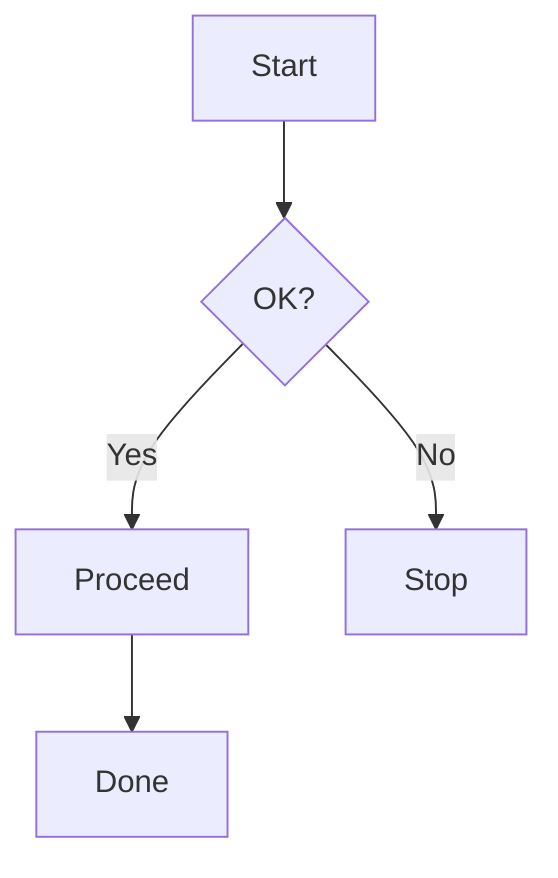
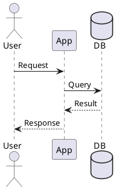
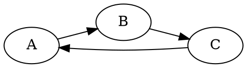

# Ultimate Markdown Showcase

[toc]

> This post intentionally includes extreme edge cases to validate rendering of complex and nested Markdown with HTML mixing, math, diagrams, code, and callouts.

## 1. Basic Formatting & Inline Elements

- **Bold**, *italic*, ~~strikethrough~~, <u>underline</u>, <s>delete</s>, <ins>insert</ins>, <small>small</small>
- `inline code` with `var foo = 1`
- <mark>highlighted text</mark>, <kbd>Ctrl</kbd> + <kbd>K</kbd>, <abbr title="HyperText Markup Language">HTML</abbr>
- Supersub: H~2~O, E = mc^2^
- Emoji: :rocket: :smile: :tada: and emoticon: :-)

Links: [example](https://example.com "Example title") and reference [ref1][ref-example].

[ref-example]: https://example.com "Reference Example"

## 2. Headings and Structure

### H3 Heading
#### H4 Heading
##### H5 Heading
###### H6 Heading

## 3. Lists (Deeply Nested)

### Unordered
- Level 1
  - Level 2
    - Level 3 with `code`
      - Level 4 with <mark>mark</mark>
        - Level 5 with <kbd>kbd</kbd>
          - Level 6 with [link](#)
            - Level 7 with **bold** and *italic*

### Ordered
1. One
   1. One.A
      1. One.A.i
         1. One.A.i.a `code`

### Mixed
1. Ordered
   - Unordered
     1. Ordered
        - Unordered

### Task List
- [x] Top task
- [ ] Pending task
  - [x] Subtask done
  - [ ] Subtask pending

### Definition List
Term 1
: Definition one with **bold** and *italic*

Term 2
: Definition two with `code` and [link](#)

## 4. Tables

| Feature | Supported | Notes |
| --- | --- | --- |
| GFM | ✅ | Tables, task lists, strikethrough |
| KaTeX | ✅ | Inline and block math |
| Diagrams | ✅ | Mermaid, PlantUML, Graphviz |
| Raw HTML | ✅ | Mixed and nested |

### Complex Table
| **Header A** | *Header B* | `Header C` |
| --- | --- | --- |
| **bold** | *italic* | `code` |
| <mark>mark</mark> | <kbd>Esc</kbd> | [link](#) |

## 5. Code Blocks

```ts
// TypeScript code sample
type User = {
  id: string
  name: string
  roles: string[]
}

export function greet(user: User) {
  const message = `Hello, ${user.name}!`
  console.log(message)
}
```

```bash
pnpm i
pnpm dev
```

```json
{
  "name": "demo",
  "private": true
}
```

```python
class MarkdownProcessor:
    def __init__(self, content: str):
        self.content = content
```

## 6. Math (KaTeX)

Inline math: $x = \frac{-b \pm \sqrt{b^2 - 4ac}}{2a}$.

Block math:

$$
\int_{-\infty}^{\infty} e^{-x^2} \, dx = \sqrt{\pi}
$$

Aligned:

$$
\begin{align}
e^{i\pi} + 1 &= 0 \\
\nabla \cdot \vec{E} &= \frac{\rho}{\varepsilon_0}
\end{align}
$$

## 7. Diagrams

### Mermaid


### PlantUML


### Graphviz DOT


## 8. Admonitions (Directives)

::: note
This is a note block with helpful context.
:::

::: tip
Pro tip goes here with **bold** and *italic*.
:::

::: warning
Be careful with edge cases and input validation!
:::

::: info
General information with `inline code`.
:::

## 9. Raw HTML and Mixed Content

<div class="mixed">
  <p>Inside HTML with <strong>bold</strong>, <em>italic</em>, and <code>code</code>.</p>
  <ul>
    <li>Nested HTML item 1</li>
    <li>Nested HTML item 2</li>
  </ul>
</div>

<details>
  <summary>Expandable Section (HTML Summary)</summary>

  Content inside details with Markdown:

  - **Bold item**
  - *Italic item*
  - `Code item`

  <p>Even more mixed <mark>content</mark> here.</p>
</details>

## 10. Images and Media

Inline image:


Linked image that should embed video (YouTube):

[](https://youtu.be/dQw4w9WgXcQ)

## 11. Blockquotes (Nested)

> Level 1 quote
> > Level 2 quote with **bold**
> > > Level 3 quote with *italic* and `code`

## 12. Wiki Links

Link to a wiki page: [[Getting Started]] and [[Deep Dive Notes]].

## 13. Escaping and Special Characters

\*Not italic\*, \`not code\`, and HTML entities: &copy; &reg; &trade; &lt; &gt; &amp;.

## 14. Footnotes

Footnote reference here[^one] and here[^two].

[^one]: First footnote with **bold** text.
[^two]: Second footnote with `inline code` and a [link](https://example.com).

---

End of test. Nothing should be left untested.


