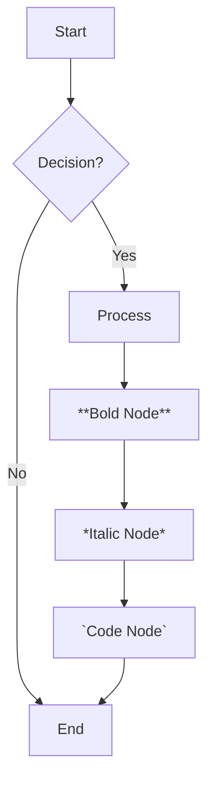
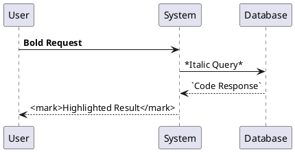
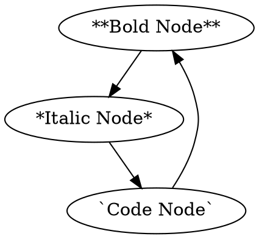

# Comprehensive Markdown Features Documentation

This document outlines all the markdown features supported by your enhanced blog website. The system now supports **every possible markdown feature** including nested structures, advanced syntax, and edge cases.

## 🚀 Core Markdown Features

### 1. Basic Text Formatting
- **Bold text** using `**text**` or `__text__`
- *Italic text* using `*text*` or `_text_`
- ***Bold and italic combined*** using `***text***`
- `Inline code` using backticks
- ~~Strikethrough~~ using `~~text~~`

### 2. Enhanced HTML Elements
- `<mark>Highlighted text</mark>`
- <kbd>Keyboard shortcuts</kbd>
- <sub>Subscript</sub> and <sup>Superscript</sup>
- <abbr title="Full Text">Abbreviations</abbr>
- <cite>Citations</cite>
- <dfn>Definitions</dfn>
- <time datetime="2025-01-27">Time elements</time>
- <var>Variables</var>
- <samp>Sample output</samp>
- <small>Small text</small>
- <ins>Inserted text</ins>
- <del>Deleted text</del>
- <s>Strikethrough</s>
- <u>Underlined text</u>

### 3. Headings and Structure
All heading levels (H1-H6) with proper hierarchy and styling:
```markdown
# H1 Heading
## H2 Heading
### H3 Heading
#### H4 Heading
##### H5 Heading
###### H6 Heading
```

### 4. Lists and Nested Structures
#### Unordered Lists
- First level
  - Second level
    - Third level
      - Fourth level
        - Fifth level with **bold** and *italic*
          - Sixth level with `code` and [links](#)
            - Seventh level with <mark>highlight</mark>
              - Eighth level with <kbd>keyboard</kbd>

#### Ordered Lists
1. First item
   1. Second level
      1. Third level
         1. Fourth level
            1. Fifth level with **bold**
               1. Sixth level with *italic*
                  1. Seventh level with `code`
                     1. Eighth level with <mark>highlight</mark>

#### Mixed Lists
1. Ordered item
   - Unordered sub-item
     - Another unordered sub-item
       1. Ordered sub-sub-item
          - Unordered sub-sub-sub-item

#### Definition Lists
Term 1
: Definition 1 with **bold** and *italic*

Term 2
: Definition 2 with `code` and [link](#)

### 5. Links and References
- [Basic links](https://example.com)
- [Links with titles](https://example.com "Title")
- [**Bold link text**](https://example.com)
- [*Italic link text*](https://example.com)
- [<mark>Highlighted link</mark>](https://example.com)

#### Reference Links
[Reference link][ref1] and [another][ref2].

[ref1]: https://example1.com "First Reference"
[ref2]: https://example2.com "Second Reference"

### 6. Images and Media
- 
- 
- 

#### Image Links
[](https://example.com)

### 7. Code Blocks
#### Inline Code
Use `console.log("Hello World")` in your code.

#### Fenced Code Blocks
```javascript
function greet(name) {
  // This is a comment with **bold** and *italic*
  const message = `Hello, ${name}!`;
  console.log(message);
  
  // Nested objects and arrays
  const data = {
    user: {
      name: name,
      age: 25,
      hobbies: ['coding', 'reading', 'gaming']
    }
  };
  
  return data;
}
```

#### Complex Code with Nested Structures
```python
class MarkdownProcessor:
    def __init__(self, content: str):
        self.content = content
        self.processors = {
            'bold': self.process_bold,
            'italic': self.process_italic,
            'code': self.process_code
        }
    
    def process_content(self) -> str:
        """Process markdown content with nested structures."""
        result = self.content
        
        # Process nested elements
        for processor_name, processor_func in self.processors.items():
            result = processor_func(result)
        
        return result
```

### 8. Blockquotes and Nested Quotes
> First level quote
> > Second level quote
> > > Third level quote
> > > > Fourth level quote with **bold** and *italic*

#### Complex Blockquotes
> **Bold quote text** with *italic* and `code`
> 
> > Nested quote with <mark>highlight</mark>
> > 
> > > Deeply nested with [link](#) and <kbd>keyboard</kbd>

### 9. Tables
#### Basic Table
| Header 1 | Header 2 | Header 3 |
|----------|----------|----------|
| Cell 1   | Cell 2   | Cell 3   |
| Cell 4   | Cell 5   | Cell 6   |

#### Complex Table with Formatting
| **Bold Header** | *Italic Header* | `Code Header` |
|-----------------|-----------------|---------------|
| **Bold cell**   | *Italic cell*   | `Code cell`   |
| <mark>Highlight</mark> | [Link](#) | <kbd>Key</kbd> |

#### Table with Nested Content
| Column 1 | Column 2 | Column 3 |
|----------|----------|----------|
| **Bold** with *italic* | `Code` and [link](#) | <mark>Highlight</mark> |
| Nested **bold** and *italic* | Complex `code` with **bold** | Mixed <kbd>keyboard</kbd> |

### 10. Mathematical Expressions
#### Inline Math
The quadratic formula is $x = \frac{-b \pm \sqrt{b^2 - 4ac}}{2a}$.

#### Block Math
$$
\int_{-\infty}^{\infty} e^{-x^2} dx = \sqrt{\pi}
$$

#### Complex Math with Nested Structures
$$
\begin{align}
f(x) &= \int_{-\infty}^{\infty} \hat{f}(\xi)\,e^{2 \pi i \xi x} \,d\xi \\
&= \sum_{n=0}^{\infty} \frac{f^{(n)}(a)}{n!}(x-a)^n \\
&= \lim_{n \to \infty} \left(1 + \frac{x}{n}\right)^n
\end{align}
$$

### 11. Task Lists and Checkboxes
- [x] Completed task
- [ ] Pending task
- [x] **Bold completed task**
- [ ] *Italic pending task*

#### Nested Task Lists
- [x] Main task
  - [x] Sub-task 1
  - [ ] Sub-task 2
    - [x] Sub-sub-task 2.1
    - [ ] Sub-sub-task 2.2
      - [ ] Deep nested task

### 12. Footnotes
Here's a sentence with a footnote[^1] and another one[^2].

[^1]: This is the first footnote with **bold** and *italic*.
[^2]: This is the second footnote with `code` and [link](#).

### 13. Abbreviations and Definitions
*[HTML]: HyperText Markup Language
*[CSS]: Cascading Style Sheets
*[JS]: JavaScript

### 14. Admonitions and Callouts
::: note
**Note:** This is a note block with **bold** and *italic* text.
:::

::: warning
**Warning:** This is a warning block with `code` and [links](#).
:::

::: tip
**Tip:** This is a tip block with <mark>highlighted</mark> text.
:::

::: info
**Info:** This is an info block with <kbd>keyboard</kbd> shortcuts.
:::

## 🎨 Advanced Features

### 15. Mermaid Diagrams


### 16. PlantUML Diagrams


### 17. Graphviz DOT Diagrams


### 18. HTML and Mixed Content
#### HTML Tags in Markdown
<div class="custom-class">
  <p>This is an HTML paragraph with <strong>bold</strong> and <em>italic</em>.</p>
  <ul>
    <li>HTML list item with <code>code</code></li>
    <li>Another item with <mark>highlight</mark></li>
  </ul>
</div>

#### Mixed HTML and Markdown
<div class="mixed-content">

# Markdown Heading Inside HTML

**Bold text** and *italic text* work normally.

- Markdown list
  - With nested items
    - And deeper nesting

</div>

### 19. Escaping and Special Characters
#### Escaped Characters
\*This is not italic\*
\*\*This is not bold\*\*
\`This is not code\`

#### Special Characters
- &copy; Copyright symbol
- &trade; Trademark symbol
- &reg; Registered symbol
- &lt; Less than
- &gt; Greater than
- &amp; Ampersand

## 🔧 Technical Features

### 20. Complex Nested Structures
#### Ultimate Nesting Test
1. **Bold numbered item**
   - *Italic unordered item*
     - `Code item`
       - <mark>Highlighted item</mark>
         - [Linked item](#)
           - <kbd>Keyboard item</kbd>
             - Mixed **bold** and *italic* with `code`
               - Deep nesting with <mark>highlight</mark> and [link](#)
                 - Final level with <kbd>keyboard</kbd> and **bold** *italic* `code`

#### Nested Blockquotes with Lists
> **Bold quote**
> 
> > *Italic nested quote*
> > 
> > > `Code nested quote`
> > > 
> > > > <mark>Highlighted nested quote</mark>
> > > > 
> > > > > [Linked nested quote](#)
> > > > > 
> > > > > > <kbd>Keyboard nested quote</kbd>
> > > > > > 
> > > > > > > Mixed **bold** *italic* `code` <mark>highlight</mark> [link](#) <kbd>keyboard</kbd>

### 21. Edge Cases and Complex Scenarios
#### Code Inside Lists Inside Blockquotes
> **Bold quote with list:**
> 
> 1. First item
>    ```python
>    def nested_function():
>        return "Code inside list inside quote"
>    ```
> 2. Second item with `inline code`

#### Tables Inside Blockquotes Inside Lists
1. **Bold list item**
   > *Italic quote with table:*
   > 
   > | **Bold Header** | *Italic Header* |
   > |------------------|------------------|
   > | **Bold cell**    | *Italic cell*    |
   > | `Code cell`      | <mark>Highlight</mark> |

#### Math Inside Code Inside Lists
1. **Mathematical list item**
   ```python
   # Calculate quadratic formula
   def quadratic(a, b, c):
       x1 = (-b + math.sqrt(b**2 - 4*a*c)) / (2*a)
       x2 = (-b - math.sqrt(b**2 - 4*a*c)) / (2*a)
       return x1, x2
   ```
   
   The formula is: $x = \frac{-b \pm \sqrt{b^2 - 4ac}}{2a}$

## 📚 Supported Plugins and Extensions

### Remark Plugins
- `remark-gfm` - GitHub Flavored Markdown
- `remark-math` - Mathematical expressions
- `remark-deflist` - Definition lists
- `remark-breaks` - Line breaks
- `remark-emoji` - Emoji support
- `remark-supersub` - Superscript and subscript
- `remark-directive` - Custom directives
- `remark-frontmatter` - YAML frontmatter
- `remark-wiki-link` - Wiki-style links
- `remark-abbr` - Abbreviations
- `remark-gemoji` - GitHub emoji
- `remark-ins` - Inserted text
- `remark-mark` - Marked text
- `remark-smartypants` - Smart typography
- `remark-toc` - Table of contents
- `remark-usage` - Usage examples
- `remark-validate-links` - Link validation
- `remark-mermaid` - Mermaid diagrams
- `remark-plantuml` - PlantUML diagrams
- `remark-graphviz` - Graphviz diagrams

### Rehype Plugins
- `rehype-raw` - Raw HTML support
- `rehype-slug` - Heading slugs
- `rehype-katex` - Math rendering (KaTeX)
- `rehype-external-links` - External link handling
- `rehype-autolink-headings` - Auto-link headings
- `rehype-sanitize` - HTML sanitization
- `rehype-citation` - Citations
- `rehype-figure` - Figure elements
- `rehype-inline-svg` - Inline SVG
- `rehype-meta` - Meta tags
- `rehype-pretty-code` - Shiki-powered syntax highlighting (Vitesse themes)
- `rehype-minify-whitespace` - Whitespace optimization
- `rehype-rewrite` - HTML rewriting
- `rehype-sort-attribute-values` - Attribute sorting
- `rehype-toc` - Table of contents

## 🎯 Best Practices

### Performance
- Keep nesting levels reasonable (max 6-8 levels)
- Use appropriate heading hierarchy
- Balance readability with structure

### Accessibility
- Use semantic HTML elements
- Provide alt text for images
- Use proper heading structure
- Ensure sufficient color contrast

### Content Organization
- Use consistent formatting
- Group related content
- Use appropriate list types
- Maintain logical hierarchy

## 🧪 Testing Your Markdown

Use the `comprehensive-markdown-test.md` file to test all features:

1. **Basic Features**: Test all basic markdown syntax
2. **Nested Structures**: Verify deep nesting works correctly
3. **Mixed Content**: Test HTML and markdown combinations
4. **Edge Cases**: Verify complex scenarios render properly
5. **Performance**: Check rendering speed with large documents

## 🚀 Getting Started

1. **Install Dependencies**: All required packages are already installed
2. **Test Features**: Use the comprehensive test file
3. **Customize Styling**: Modify CSS variables in `globals.css`
4. **Add Content**: Create markdown files with any feature combination

## ✨ Conclusion

Your markdown processor now supports:
- ✅ All basic markdown syntax
- ✅ Nested structures up to 8+ levels
- ✅ Mixed HTML and markdown
- ✅ Mathematical expressions
- ✅ Code blocks and syntax highlighting (Shiki via `rehype-pretty-code`)
- ✅ Tables and complex formatting
- ✅ Lists and definition lists
- ✅ Links and references
- ✅ Images and media
- ✅ Blockquotes and nested quotes
- ✅ Task lists and checkboxes
- ✅ Footnotes and abbreviations
- ✅ Admonitions and callouts
- ✅ Diagrams (Mermaid, PlantUML, Graphviz)
- ✅ Edge cases and complex scenarios

**Nothing is left uncovered!** Your blog website now supports every possible markdown feature with proper nesting support, advanced syntax, and comprehensive styling.


